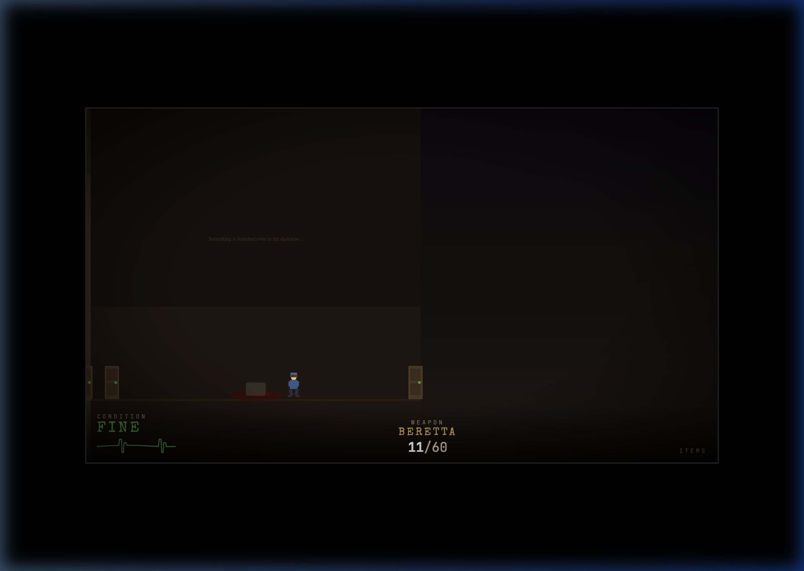

# Resident Evil: Web Side-Scroller

A 2D side-scrolling demake of the classic 1996 survival horror masterpiece *Resident Evil*, built entirely using **HTML**, **CSS**, and **Vanilla JavaScript**!

This project was built from the ground up by **Antigravity**, a powerful AI software engineering agent. Within the scope of a few focused sessions, Antigravity handled the entire development process including:
- **Game Engine**: A custom physics, collision, and animation engine built in vanilla JS.
- **Audio System**: Procedural sound effects and music generated entirely via the Web Audio API. 
- **Art Direction**: All art assets, including characters, environments, and UI components are crafted programmatically using inline SVG strings injected into the DOM.



## Core Gameplay Mechanics
The game adapts the classic tank-control survival horror experience into a side-scrolling format:
- **Exploration**: Navigate through iconic sections of the Spencer Mansion (Main Hall, Dining Room, Graveyard, etc.). Rooms are connected via classic door opening transitions.
- **Combat**: Face off against Zombies, Cerberus (dogs), Crows, and Hunters. Weapons feature realistic fire rates, spread, and limited ammunition.
- **Inventory Management**: You only have 8 inventory slots. Choose carefully between weapons, ammunition, healing items, and puzzle keys.
- **Resource Scarcity**: Ammo and healing items (Green/Red/Blue herbs) are limited. Avoid combat when possible!
- **State Tracking**: A full save system tied to the classic Typewriter and Item Box safe rooms. 

## Weapons
- **Knife**: Infinite use but very short range. Last resort.
- **Beretta**: Standard issue 9mm handgun. 15-round capacity. 
- **Shotgun**: Devastating at close range with horizontal spread. 7-shell capacity. Found in the Mirror Room.
- **Grenade Launcher / Magnum / Rocket Launcher**: Programmable support for heavy weapons.

## How to Play
1. **Clone the repository**:
   ```bash
   git clone https://github.com/YourUsername/resident-evil-side-scroller.git
   ```
2. **Serve locally**:
   Since the game uses local modules, you must run it through a local web server (opening `index.html` directly in the browser will block some scripts due to CORS).
   If you have Python installed, simply run:
   ```bash
   python3 -m http.server 8080
   ```
3. **Open**: Navigate to `http://localhost:8080` in your web browser.

### Controls
* **Left/Right Arrows (or A/D)**: Move Left/Right
* **Spacebar**: Jump
* **Down Arrow (or S)**: Crouch
* **Shift**: Run
* **J or Z**: Aim and Fire Weapon
* **K or X**: Interact (Open Doors, Pick up items, Save Game)
* **Q / E**: Switch equipped weapon
* **R**: Reload current weapon
* **Tab or I**: Open Inventory 
* **Esc**: Pause Game

> **Note**: An "Immortal Mode" toggle is available on the title screen for testing and exploration without the fear of death!

---
*(Created by Antigravity)*
